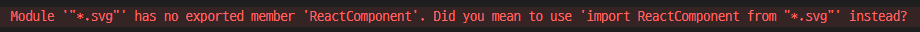

# React SVG 사용하기

## Vite + React에 SVG 설정

react-vite에 SVG를 넣을려고 import를 하니 에러가 표시
```javascript
import { ReactComponent as Logo } from '../assests/logo.svg
```


## React-Vite에서 SVG 넣는 3가지 방법
### 1. `` 태그에 경로로 넣는 방법

```html

```
### 2. `vite-plugin-svgr`를 사용하기

```bash
yarn add vite-plugin-svgr
```

```javascript
//vite.config.ts
import { defineConfig } from 'vite'
import react from '@vitejs/plugin-react'
import svgr from 'vite-plugin-svgr' // 추가분

export default defineConfig({
  server: {
   host: '0.0.0.0',
  },
  plugins: [
    react(),
    svgr(), // 추가분
  ],
})
```
#### Error 발생 - ***Typescript*** 사용 시 SVG 모듈로 인식을 못해서 발생. 
   
#### 에러해결 방법 `src폴더` 안에 파일 `svg.d.ts` 생성
```javascript
//svg.d.ts file
declare module '*.svg' {
  import React from 'react'
  // ReactComponent 를 사용할 때만 사용.
  export const ReactComponent: React.FC<React.SVGProps<SVGSVGElement>>;
  // 밑에 부분은 SVG파일 경로를 문자열을 내보내는데 사용.  태그에 사용.
  const src: string;
  export default src;
}
```
   
### 3. JSX 작성하여 사용하기
```javascript
function Logo() {
  return (
    <div>
      <svg width="100" height="100">
        <circle cx="50" cy="50" r="40" stroke="green" stroke-width="4" fill="yellow" />
      </svg>
    </div>
  );
}

```

### ***img***와 ***vite-plugin-svgr*** 차이
``태그 사용시 img를 통하여 적용되기에 SVG에서 사용되는 `색깔 크기 등`을 변경하거나 할 수 없기에 만약 변경될 가능성이 없으면 ``태그를 사용하는 것도 나쁘지 않다고 생각합니다.