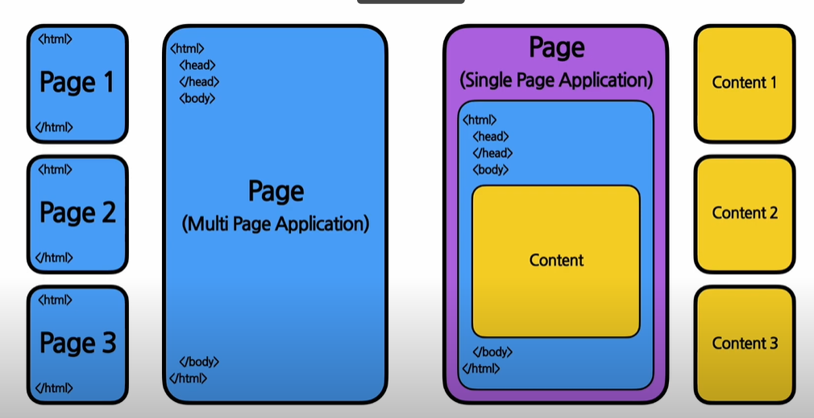
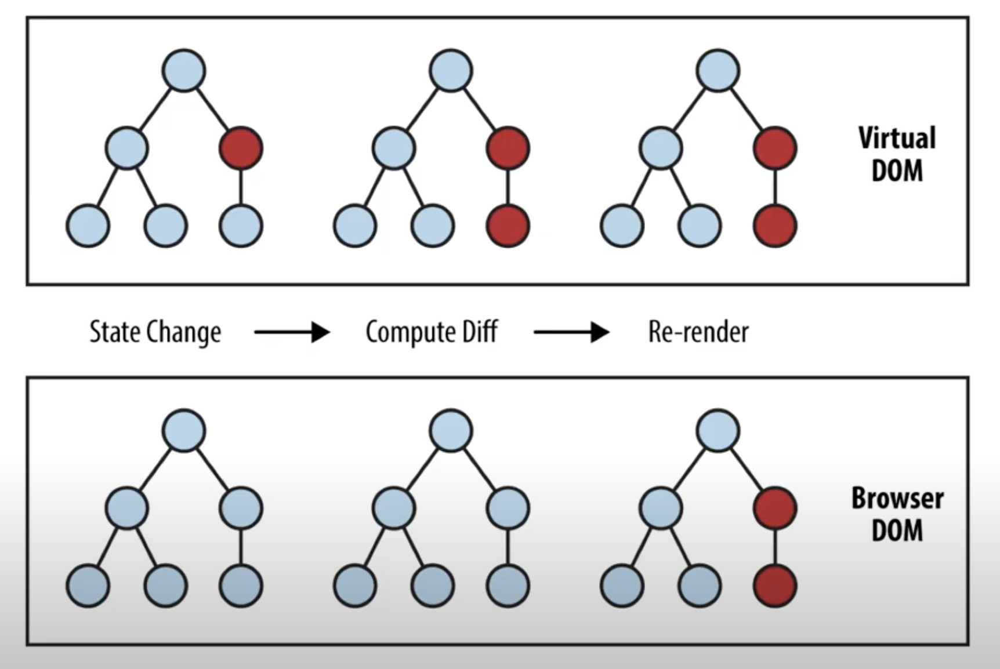
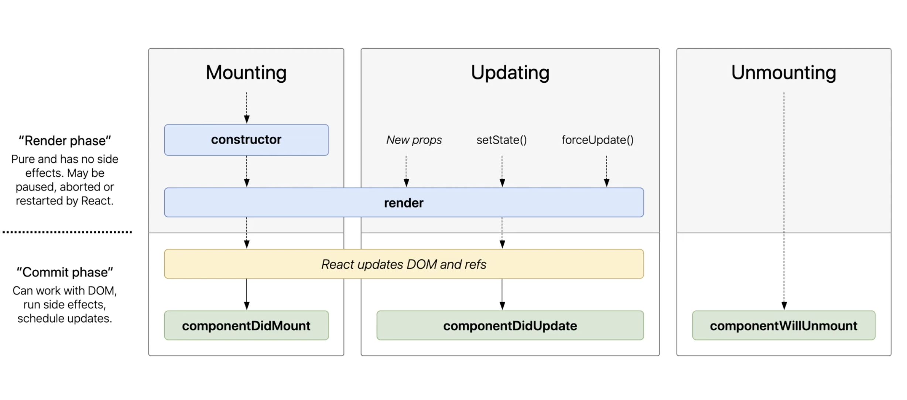

# React

## 전통적인 웹어플리케이션 vs SPA

SPA -> 하나의 html 페이지를 가지는 웹사이트


<br />

## VirtualDom Cycle


가상의 화면(VirtualDom)
실제 화면(BrowserDom)
바뀐 부분을 VirtaulDom에서 찾고 실제화면(BrowserDom)에 변화된 부분만 적용

## Elements

리액트를 구성하는 가장 작은 블록들

### Elements 특징

\- `불면성` : elements 생성후에는 변경이 불가능 하다. 

<br />

## Component
항상 대문자로 시작해야하는 컴포넌트    
<br/>
`Function Component`    

```typescript
function Welcome(props) {
  return <h1>안녕 {props.name}</h1>
}
```
`Class Component`   

```typescript
class Welcome extends React.Component {
  render() {
    return <h1>안녕 {this.props.name}</h1>
  }
}
```

## Component Lifecycle



<br />

## Statae
리액트 Component의 변경 가능한 데이터

<br />

## Hook
\- function Component에서 state를 정의하거나 LifeCycle 생명주기에 맞춰서 만들수 없어서 생겨난 기능   
\- 앞부분에 use가 붙음   
\- useState, useEffect 등이 존재

### useEffect
```javascript
/** useEffect  */
useEffect(() => {
  /*
   컴포넌트가 마운트 된 후
   의존성 배열 있는 변수들 중 하나라도 값이 변경 되었을 떄 실행
   의존성 배열에 빈 배열([])을 넣으면 마운트, 언마운트에 단 한 번씩만 실행
   의존성 배열 생략시 컴포넌트 업데이트 시마다 실행
   */
return () => {
  /* 컴포넌트가 마운트 해제되기 전에 실행됨됨 */
}
}, [])
```

### useMemo
\- `useMemo` : Memoized value를 리턴하는 Hook (최적화)   
\- `useMemo`로 전달된 함수는 렌더링이 실행되는 동안 작동   
\- 렌더링이 일어나는 동안 실행되서는 안되는 함수는 쓰지 않기 `(서버에서 데이터 받아오기, 수동으로 Dom 변경)`


```javascript
const memoizedValue = useMemo(
  () => {
    /* 
      연산량이 높은 작업 수행하여 결과를 반환
      의존성 배열을 넣지 않으면 매 랜더링 마다 함수 실행
      의존성 배열이 비어있을 경우 마운트 시에만 호출
    */
    return computeExpensiveValue('의존성변수1', '의존성변수2');

  }, ['의존성변수1', '의존성변수2']
);
```

### useCallback
\- 값이 아닌 함수를 반환   
\- `useCallBack(함수, 의존성 배열)` === `useMemo(() => 함수, 의존성 배열)`   

```javascript
const memoizedvCallBack = useCallBack(
  () => {
    /* 
      연산량이 높은 작업 수행하여 결과를 반환
      의존성 배열을 넣지 않으면 매 랜더링 마다 함수 실행
      의존성 배열이 비어있을 경우 마운트 시에만 호출
    */
    doSometing('의존성변수1', '의존성변수2');

  }, ['의존성변수1', '의존성변수2']
);
```
```javascript
// 재랜더링 될 때마다 매번 함수가 새로 정의
const handleClick = () => {
  // 클릭 이벤트
}

// 컴포넌트 마운트 될 때만 함수가 정의됨 
const handleClick = useCallBack((event) => {
  // 클릭 이벤트
}, []);

```

### useRef
\- Reference를 사옹하기 위한 hook    
\- refObject.`current` : 현재 참조하고 있는 Element   
\- 내부의 데이터가 변경되었을 때 별도로 알리지 않는다.(current을 변화시킨다고 재랜더링 안됨.)

```javascript
const refContainer = useRef(초깃값);
```
\- Dom 노드가 연결되거나 분리되었을 경우에 코드를 실행 하고 싶을때   
\- `Callback ref` 사용
```javascript

function MeasureExample(props) {
  const {height, setHeight} = useState(0);

  const measuredRef = useCallBack((node) => {
    if (node !== null) {
      setHeight(node.getBoundingClientReact().height);
    }
  }, [])

  return (
    <>
      <h1 ref={measuredRef}>안녕</h1>
      <h2>위 헤더의 높이는 {Math.round(height)}px 입니다.</h2>
    </>
  )
}
```

### Hook 규칙
\- 무조건 최상위 레벨에서만 호출 `리액트 function Component의 최상위 레벨`   
\- `리액트 function Component`에서만 Hook 호출
\- 반복문, 조건문, 중첩된 함수함수에서 호출되면 안된다.   
\- Component가 렌더링될 때마다 매번 같은 순서로 호출되어야 한다.   
\- eslint-plugin-react-hooks

### Custom Hook
\- Custom Hook 이름은 꼭 use로 시작.   
\- hook 데이터를 공유하는 법

```javascript
const {userId, setUserId} = useState(1);
const isUserOnline = useUserStatus(userId);
```


<br />
<br />

> "이미지 출처, source 출처"  
> \- ([소플TV](https://www.youtube.com/@TV-wq6zp))
