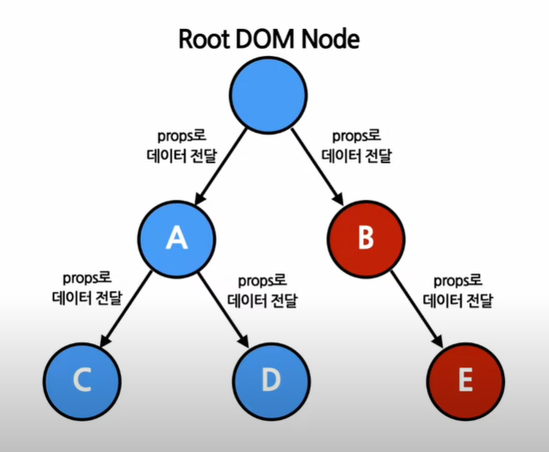
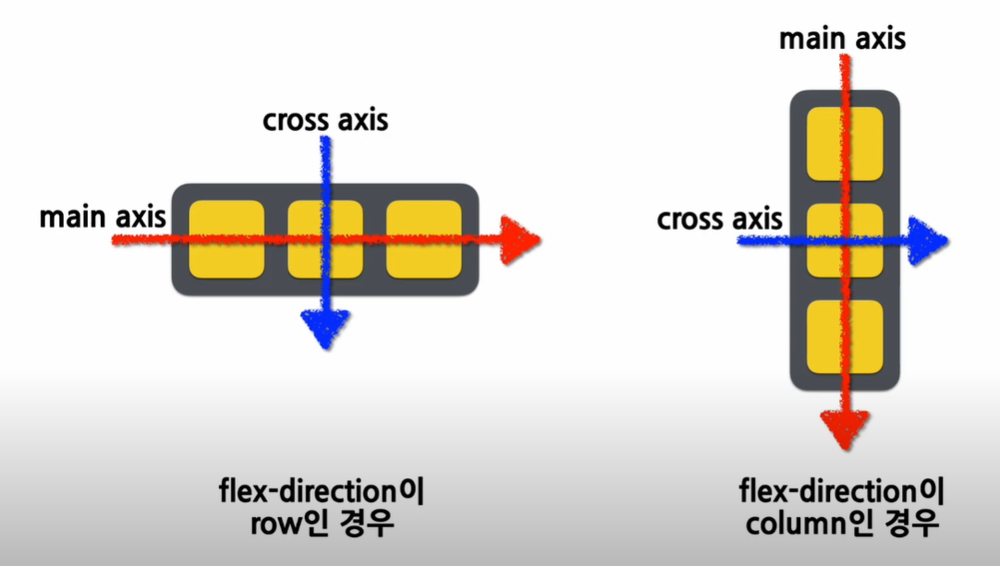
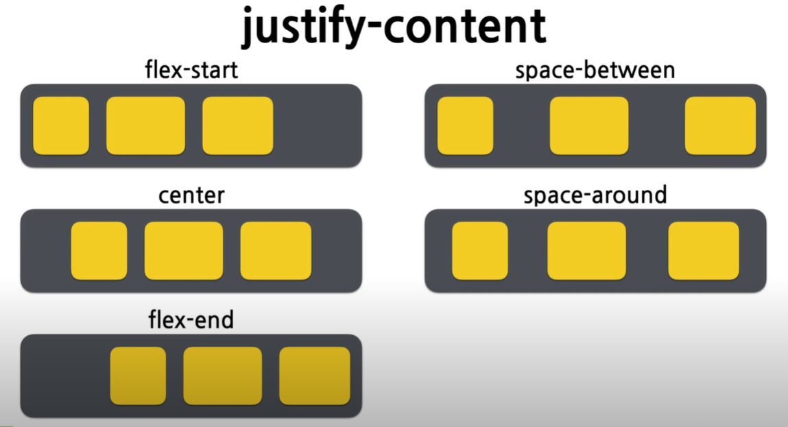

# React

## Context
\- 기존 방식   
 

## Context API
\- 만약 상위 레벨에 매칭되는 Provider이 없다면 기본값이 사용됨   
\- 기본값이 undefined 넣으면 기본값이 사용안됨
```javascript
/*
 Context 생성 
*/
const MyContext = React.createContext(기본값);

/*
Provider 사용
*/
<MyContext.Provider value={/* value */}> </Mycontext>
```

<br />

### 주의사항
\- Provider 컴포넌트가 재랜더링 될때 마다 모든 하위 consumer 컴포넌트가 재랜더링 됨.

### Context.Consumer
\- Context 데이터를 구독하는 데이터 함수 Component에서 사용
```javascript
<MyContext.Consumer>
 {value => /* 컨테스트의 값에 따라서 컴포넌트들을 렌더링  
 Provider 값이 없으면 처음 넣는 기본값으로 들어갑니다.*/}
</MyContext.Consumer>
```

### Function as as child
```javascript
// children 이라는 props을 직접 선언하는 방식
<Profile children={name => <p>이름: {name}</p> } />

// Profil 컴포넌트로 감싸서 children으로 만드는 방식
<Profile>
 {name => <p>이름: {name}</p> }
</Profile>
```

### Context.displayName
```javascript
const MyContext = React.createContext();
MyContext.displayName = "MyDisplayName";

// 개발자 도구에 MyDisplayName.Provider로 표시
<MyContext.Provider>
// 개발자 도구에 MyDisplayName.Consumer로 표시
<MyContext.Consumer>
```

### useContext()
\- Context를 쉽게 사용하기위한 Hook
```javascript
function MyComponent(props) {
  const value = useContext(MyContext);

  return ( ... );z
}
```
## Styling CSS

## flexbox
\- flex-direction rows, colums


<br />

### align-items
\- `flex-start` : cross-axis의 시작지점으로 아이탬 정렬   
\- `center` : cross-axis의 중간지점으로 아이탬 정렬   
\- `flex-end` : cross-axis의 끝지점으로 아이탬 정렬   
\- `stretch` :  기본 값으로 아이템을 늘려 컨테이너를 채움  
\- `baseline` : 아이템을 baseline 기준으로 정렬   


<br />

### justify-content
\- `flex-start` : main-axis의 시작지점으로 아이탬 정렬   
\- `center` : main-axis의 중간지점으로 아이탬 정렬   
\- `flex-end` : main-axis의 끝지점으로 아이탬 정렬   
\- `space-between` : main-axis 기준으로 첫 아이탬은 시작지점 마지막 아이템은 끝 지점 맞춤   
\- `space-around` : main-axis를 기준으로 각 아이템을 주변 간격을 동일하게 맞춤   



## font

### font-family
\- 여러개 family를 작성한다. 글자가 꺠지지 않고 나오게 하기위해 필요.   
\- `serif`: 각 글자의 모서리에 작은 테두리를 갖고 있는 형태 글꼴   
\- `sans-serif`: 모서리에 테두리가 없이 깔끔한 선을 가진 글꼴(컴퓨터 모니터에서는 serif보다 가독성 좋음)   
\- `monospace`: 모든 글자가 같은 가로 길이를 가지는 글꼴. 코딩을 할 때 주로 사용   
\- `cursive`: 사람이 쓴 손글씨 모양의 글꼴   
\- `fantasy`: 장식이 들어간 형태의 글꼴    

### font-size
\- px   
\- em == 16px  
\- rem   
\- vw  

### font-style
\- normal: 일반적인 글자의 형태를 의미   
\- italic: 글자가 기울어진 형태로 나타남   
\- oblique: 글자가 비스듬한 형태로 나타남   


### Untagged template literal과 Tagged template literal
```javascript
//Untageed template literal
`string text`
// multi-line
`string text line 1
 string text line 2`

 `string text ${express} string text`

//Tagged template literal
 myFunction` string text ${express} string text`

```

<br />

<br/>
<br/>

> "이미지 출처, source 출처"  
> \- ([소플TV](https://www.youtube.com/@TV-wq6zp))
