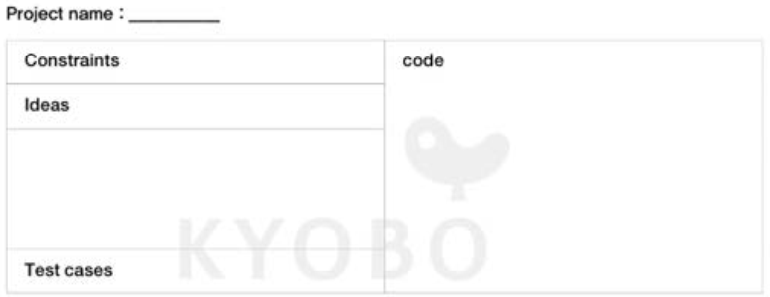

# 자료구조와 알고리즘 (Data Structure and Algorithm)

## 노트레이아웃을 이용한 공부

\- 문제 분석과 함께 어떤 알고리즘과 자료구조가 적절한지 파악한다.   
\- 문제로 부터 요구사항과 제한사항을 수집한다. 
\- 어떤 식으로 접근할지 다양한 아이디어를 제시한다.
\- 코딩을 통합개발 환경 도움 없이 화이트보드나 종이에 연습한다.
\- 시간 / 공간 복잡도를 고려한다.
\- 어떤 테스트 케이스를 통과하는지 대해 고려한다.

## 노트 레이 아웃

### Constraints(범위, 제한사항)
\- 기본 변수 타입의 범위 벗어나는 경우를 미리 파악할 필요가 있다.   
\- 문자열, 배열, 그리고 숫자   
* 배열에서 요소들이 유일값인지 중복을 허용하는지 등
* 배열 크기제한 문자열 크기제한 정수 크기제한
* 어떤 요소가 있는지 등

\- 반환값 : 어떤형태, 어떤 값을 원하는지 정확히 파악   
  * 반환값이 여러개면 어떤 형태로 반환하는지   
  * 허용하지 않는 값이 들어왔을때 어떤 값으로 반환 할지

### Ideas(아이디어)

> 이미지, 내용 출처   
> \- 쓰면서 익히는 알고리즘과 자료구조

