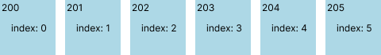
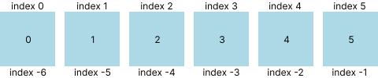

# Array(Data Structure)

[웹에서 python(Python Tutor)](https://www.pythontutor.com)

\- 배열   
* 연속적인 메모리 공간에 저장된 아이템 집합을 표현한 자료구조
* 같은 타입을 연속적으로 저장하는 방식으로 운영

<br/>



\- 배열을 생성하고 메모리 주소가 200으로 시작 했으고 연속적인 공간에 배열 인덱스 0, 1, 2의 값으로 접근할 수 있다.

## 리스트(List)
\- python에서 배열 속성 지원하기 위해 `List`와 `Arry 모듈`이 있다.   
\- 일반적으로는 `Array 모듈`이지만 `python`에서 `List`도 `Array` 처럼 쓸 수 있다.  
\- 차이점: `List`는 여러 타입을 하나의 자료구조로 담을 수 있고 `Array`는 하나의 타입만 넣을 수 있다.   

### List 생성 방법
```python
py_list_empty = []
print(py_list_empty) # 결과값: []

py_list = [1,2,3,4,5]
print(py_list) # 결과값: [1, 2, 3, 4, 5]

py_list_zero_1 = [0 for i in range(10)]
print(py_list_zero_1) # 결과값: [0, 0, 0, 0, 0, 0, 0, 0, 0, 0]

py_list_zero_2 = [0] * 10
print(py_list_zero_2)# 결과값: [0, 0, 0, 0, 0, 0, 0, 0, 0, 0]
```

### List 추가 방법
\- append() 추가, extend() 확장, insert() 추가   
```python
py_list = [1, 2, 3, 4, 5]
py_list.append(6)
print(py_list) # 결과값 [1, 2, 3, 4, 5, 6]

py_list_1 = [1, 2, 3]
py_list_2 = [4, 5, 6]
py_list_1.append(py_list_2)
print(py_list_1) # 결과값 [1, 2, 3, [4, 5, 6]]

py_list_1 = [1, 2, 3]
py_list_2 = [4, 5, 6]
py_list_1.extend(py_list_2)
print(py_list_1) # 결과값 [1, 2, 3, 4, 5, 6]

py_list = [1, 2, 3]
py_list.insert(3, 4)
print(py_list) # 결과값 [1, 2, 3, 4]
```

### List 삭제 방법
\- remove(), clear(), del
```python
# list는 중복된 값이 있을 수 있고 여러 값들 중 가장 앞선 인덱스의 요소가 삭제
py_list = [1, 2, 3, 2, 4]
py_list.remove(2)
print(py_list) # 결과값 [1, 3, 2 4]

py_list = [1, 2, 3, 4]
py_list.clear()
print(py_list) # 결과값 []

# 두번째 있는 요소를 삭제한다.
py_list = [1, 2, 3, 4]
del py_list[1]
print(py_list) # 결과값 [1, 3, 4]
```

### List 요소 접근 인데싱
\- 기본적으로 인덱스 0 부터 시작해 해당 길이 -1 만큼 접근 가능   
\- 마지막 인덱스는 -1 부터 시작 인덱스는 해당 길이 마이너스 만큼 접근 가능   


```python

py_list = [1, 2, 3, 4, 5, 6]
print(py_list[3] ) # 결과값 4
print(py_list[-1]) # 결과값 3

```
### 또다른 접근 방법 슬라이싱(slicing)
\- `:`을 이용해 범위 지정이 가능하다   
\- `:`의 앞은 시작인덱스 뒤는 리스트 끝 지점 지정   
\- `:`하나일때는 앞에서 부터 진행되기 때문에 `-`경우도 거기에 맞춰서 작성해야한다.   

```python
py_item = [1, 2, 3, 4, 5, 6, 7, 8, 9]

print(py_item[3:8]) # 결과값 [4, 5, 6, 7, 8]
print(py_item[4:]) # 결과값 [5, 6, 7, 8, 9]
print(py_item[:2]) # 결과값 [1, 2]
print(py_item[-8:-4]) # 결과값 [2, 3, 4, 5]
print(py_item[-8:]) # 결과값 [2, 3, 4, 5, 6, 7, 8, 9]
print(py_item[:-2]) # 결과값 [1, 2, 3, 4, 5, 6, 7]

# :: 경우 리스트를 역순으로 가져올 수 있다.
print(py_item[::-1]) # 결과값 [9, 8, 7, 6, 5, 4, 3, 2, 1]
```

## Array 모듈
\- 한 번 설정한 타입의 요소만 추가/ 삭제가 가능합니다.

### Array 모듈을 통한 초기화
```python
import array as arr

int_arry = arr.array('i', [1, 2, 3])
print(int_arry) # 결과값 arry('i', [1, 2, 3])
```
\- 앞부분은 해당 배열 타입을 정하는 문자이며 이며 다른 것은 밑에 표로 작성하였습니다.
|Type code|C 언어타입|python 타입|최소크기(바이트)|
|:---:|:---:|:---:|:---:|
|'b'|signed char|int|1|
|'B'|unsigned char|int|1|
|'u'|Py_UNICODE|unicode<br/>character|2|
|'h'|signed short|int|2|
|'H'|unsigned short|int|2|
|'i'|signed int|int|2|
|'I'|unsigned int|int|2|
|'l'|signed long|int|4|
|'L'|unsigned long|int|4|
|'q'|signed long long|int|8|
|'Q'|unsigned long long|int|8|
|'f'|float|float|4|
|'d'|double|float|8|

<br/>

### Array 모듈 삽입/삭제

```python
import array as arr

int_arr = arr.array('i', [1, 2, 3])
# end =""가 없으면 마지막에 자동 개행 되지만 개행되지 않고 빈값을 넣겠다는 뜻.
print("element is array: ", end ="") 
# range(start, end, step) => start 부터 시작해서 end(포함안됨) 미만까지 step은 설정안하면 기본값 1
for i in range(0, len(int_arr)):
    print(int_arr[i], end = " ")
print() # 개행

# index 1번째 자리에 4 대입
int_arr.insert(1, 4)
print("element is array insertion: ", end="")
for i in (int_arr):
  print(i, end=" ")
print()

# 첫번째로 찾은 1 삭제
int_arr.remove(1)
print("element after delete \'1\' in array: ", end="")
for i in (int_arr):
  print(i, end=" ")
print()

# 결과값:
# element is array: 1 2 3 
# element is array insertion: 1 4 2 3 
# element after delete '1' in array: 4 2 3
```
### Array 모듈을 이용한 배열 접근 및 값 업데이트


<br/>
<br/>

> 이미지, 내용 출처   
> \- 쓰면서 익히는 알고리즘과 자료구조
