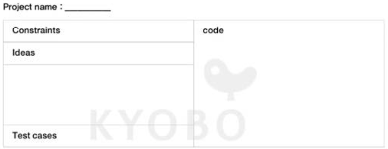

# 자료구조와 알고리즘 (Data Structure and Algorithm)

## 노트레이아웃을 이용한 공부

\- 문제 분석과 함께 어떤 알고리즘과 자료구조가 적절한지 파악한다.   
\- 문제로 부터 요구사항과 제한사항을 수집한다. 
\- 어떤 식으로 접근할지 다양한 아이디어를 제시한다.
\- 코딩을 통합개발 환경 도움 없이 화이트보드나 종이에 연습한다.
\- 시간 / 공간 복잡도를 고려한다.
\- 어떤 테스트 케이스를 통과하는지 대해 고려한다.

## 노트 레이 아웃


<br/>

### Constraints(범위, 제한사항)
\- 기본 변수 타입의 범위 벗어나는 경우를 미리 파악할 필요가 있다.   
\- 문자열, 배열, 그리고 숫자   
* 배열에서 요소들이 유일값인지 중복을 허용하는지 등
* 배열 크기제한 문자열 크기제한 정수 크기제한
* 어떤 요소가 있는지 등

\- 반환값 : 어떤형태, 어떤 값을 원하는지 정확히 파악   
  * 반환값이 여러개면 어떤 형태로 반환하는지   
  * 허용하지 않는 값이 들어왔을때 어떤 값으로 반환 할지

<br/>

### Ideas(아이디어)
\- 여러가지를 문제 풀이를 생각하며 풀어 보자.
* 배열의 특정값을 찾는 경우
* 처음부터 찾는것, 정렬된 배열경우 이진 탐색, 등

\- 예시
***   
아이디어 : 로만 문자를 정수로 바꾸로 바꾸기
***
* 로만 문자에 해당 하는 값을 HashMap에 대입 저장.
* 로만 문자열 맨 뒤부터 하나씩 문자를 접근한다.
* 각 문자는 HashMap에서 값을 꺼낼수 있다.
* 꺼낸 문자가 이전 문자보다 큰 수 일 때는 더해주고 작은 수 일 때는 빼준다. 
***
\- 다른 접근법이 있을 경우 아이디어 칸을 늘려서 만들어 주면 된다.   

<br/>

### Complexity(복잡도)   
\- 시간 및 공간 복잡도를 나타내는 Big-O(빅오) 접근법
* 가장 최악의 경우를 고려한 표기법   
  
\- O(N)  
```python
j = 0;
for i in range(N):
  j += i;
```
* i는 0 부터 N 까지 증가
* j 변수에 i값 더하기 실행하며 `N번`까지 덧셈이 발생
* 그렇기 대문에 O(N)

\- O(N$^2$)   
```python
k = 0;
for i in range(N):
  for j in range(N):
    k = i + j
  
for i in range(N):
  k += i
```
* 두개의 루프가 존재.
* 첫번 째 루프는 `i = 0` 일때 j가 `0 ~ N - 1` 까지, `i = 1` 일때 `j가 0 ~ N - 1` 까지 수행함
* 그렇기 때문에 첫번 째 루프는 `N * N`
* 두번 째 루프는 i값이 `0 ~ N - 1` 까지 증가
* k에 i값 더하기를 `N`번까지 실행
* 그렇기 떄문에 두번 째 루프는 `N`
* 전체적으로 ***O(N$^2$ + N)***
* 하지만 시간 복잡도 경우 `(+)`경우 가장 큰 형태(최고차항)만 남겨놓아도 되기 때문에 ***O($N^2$)*** 만 남겨 둔다.  

\- O(N*$\log_{2}n$)   
```python
i = 0;
k = 0;
for i in range(int(n / 2), n + 1):
  j = 2
  while j <= n:
    k = k + int(n / 2)
    j = j * 2
```
* 첫번 째 루프는 `n / 2` 에서 부터 `n`까지 수행
* 두번 째 루프는 `j` 가 `n`까지 도달하기에 `j`가 `2배`씩 증가 한다.
* i = $n/2$ 만 큼 수행하고 j = $logn$ 만큼 수행 한다.
* 빅오로 표기하면 O($n/2 * logn$)이며 앞에 붙은 곱에 계수는 빅오에서 연산 크기에 영향을 주지 않는다.
* 그렇기 때문에 O($n * logn$)가 된다.

### Big-O chat sheet

|자료구조|접근(Access)|검색(Serch)|삽입(Insertion)|삭제(Deletion)|
|:---|:---:|:---:|:---:|:---:|
|배열|$O(1)$|$O(n)$|$O(n)$|$O(n)$|
|스택|$O(n)$|$O(n)$|$O(1)$|$O(1)$|
|큐|$O(n)$|$O(n)$|$O(1)$|$O(1)$|
|해시 테이블|$O(N/A)$|$O(1)$|$O(1)$|$O(1)$|
|이진 트리|$O(logn)$|$O(logn)$|$O(logn)$|$O(logn)$|
###### 기본 자료구조 시간 복잡도(Big-O)

<br/>

|정렬 알고리즘|최선(Best)|평균(Average)|최악(Worst)|
|---|---|---|---|
|퀵 정렬(Quick sort)|$O(nlogn)$|$O(nlogn)$|$O(n^2)$|
|병합 정렬(Merge sort)|$O(nlogn)$|$O(nlogn)$|$O(nlogn)$|
|힙 졍렬(Heap sort)|$O(nlogn)$|$O(nlogn)$|$O(nlogn)$|
|거품 정렬(Bubble Sort)|$O(n^2)$|$O(n^2)$|$O(n^2)$|
###### 기본 정렬 알고리즘 시간 복잡도(Big-O)

### Code(코드 작성)
\- 아이디어에 해당 하는 코드 작성   
\- 개발도구에 의존하지 않고 작성   
\- 작성한 코드를 테스트 케이스로 확인한뒤 컴퓨터로 작성해 본다.
\- 주의할 점   
* 코딩하기 전에 조금 더 고민하자
* 변수 이름을 명확하고 알맞게 정의하자
* 작은 단위의 논리적 조각으로 분해하여 분석하고 다른 코드와 섞이지 않도록 노력한다.
* 자신이 작성한 코드를 여러 번 검토하자 `(스스로 코드가 어떻게 진행 될지 상상해보자)`

### Test cases(테스트 케이스 검토)
\- 가장 기본적인 테스트 입력값으로 확인해본다.
\- 기본적인 테스트가 되었다면 추가적으로 확인해야하는 테스트를 진행해보자.   
* 에지 케이스(Edge case): 제한사항에서 제시한 입력값의 범위가 주어진 값을 벗어나는 경우에 어떤 식으로 동작하는지 알아보자.
* 해결책이 없는 경우: Null or None 들어올 경우 어떻게 처리할 것인가.
* 다양한 테스트 케이스: 여러 테스트 케이스를 생각해보자 `(자신이 기본적으로 테스트했다 싶으면 온라인 코딩문제에 직접 실행해보고 어떤 부분이 부족한지 찾아보자)`

## 자료구조와 알고리즘 설명
### [@배열(Array)](/record-lists/2023-lists/20230408-array-data-structure.md)
\- 가장 기본적인 자료구조.   
\- 다양한 예제를 통한 학습과 연습 필요.   
### 문자열(String)
\- 가장 많이 사용되는 회문 / 애너그램 등을 통해 연습.   
\- 정규표현식 활용 능력을 키우면 좋다.   
### 연결 리스트(Linked List)
\- 노드간 이동 순서 변경 이해필요.   
### 스택과 재귀(Stack and Recursion)
\- 문제 해결을 위한 방법으로 적용하기가 힘들고 어려움.
\- 다양한 문제를 풀어보고 이해하기 위해 공부.
### 큐(Queue)
\- 너비 우선 탐색 
### 트리(Tree)
\- 탐색 문제의 기본 구조    
\- 깊이, 너비 우선 탐색을 이해하고 해당 탐색을 이용하여 공부한다.
### 동적 프로그래밍(Dynamic Programming) 
\- 재귀로 전체 탐색을 이해했으면 재귀적 방식의 확장인 동적 프로그맹도 이해가 필요   

[Python Tutor](https://www.pythontutor.com)   

<br/>
<br/>

> 이미지, 내용 출처   
> \- 쓰면서 익히는 알고리즘과 자료구조


