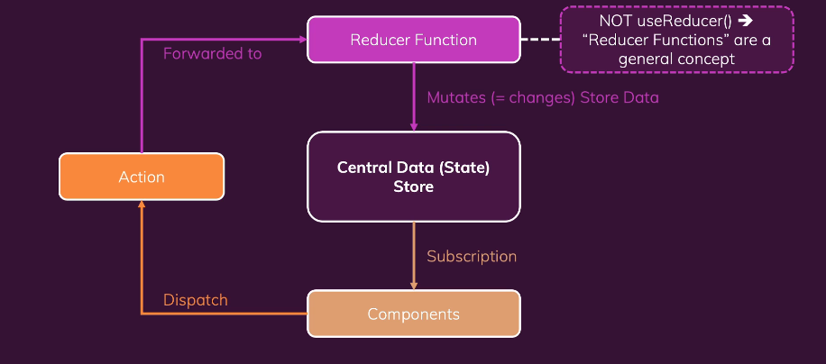

# Redux

## 상태의 구분

- 로컬 상태(Local State)
  - 단일 컴포넌에 속하는 상태
- 크로스 컴포넌트 상태(Cross-COmponent State)
  - 다수의 컴포넌트에 영향을 미치는 상태
- 앱 와이드 상태(App -Wide State)
  - 애플리케이션 전체에 영향을 미치는 상태

## 왜 Context API가 아닌 Redux 인가

**Context API** 잠재적 단점이 있습니다.

대형 프로젝트 경우에 사용할려면 `Context Provider`가 여러개 사용 되어 설정과 상태가 복잡해질 수 있습니다.

저빈도에 경우는 상관없지만 자주 바뀌는 고빈도에는 별로 좋지 못하다는 리액트 개발자가 언급한적이 있습니다. 즉 성능에 문제가 발생할 수 있습니다.

## 리덕스 작동 방식

리덕스는 한개의 저장소(store)을 가집니다 두개의 저장소를 가지지 않습니다.

이 한개의 전체 애플리케이션의 모든 상태를 저장합니다.

변경이 필요한 컴포넌트에서 저장소에 구독을 설정하고 데이터가 변경할 때마다 저장소에서 컴포넌트로 알려 줍니다.

리듀서 함수를 이용하여 상태를 변경 합니다. (useReducer과는 다른 것입니다.)



## 리덕스 개념

리덕스의 리듀스 함수는 항상 2개의 입력을 받을 것 이며 그것은 `state`와 `action` 입니다.  
또한 리듀스 함수는 항상 개로운 상태 객체를 리터해야합니다. 그렇기 때문에 리듀서 함수는 항상 순수한 함수여야 합니다.

즉 항상 정확히 같은 출력이 산출되어야 합니다.

그리고 부수적인 효과도 있으면 안됩니다.(http에 요청을 한다거나 로컬에 저장을 한다는 등의 기능이 없어야 합니다.)


### 간단한 리덕스 예제

```javascript
const redux = require('redux');

const counterReducer = (state = { counter: 0}, action) => {
  if (action.type === 'increment') {
    return {
      counter: state.counter + 1
    }
  }
  if (action.type === 'decrement') {
    return {
      counter: state.counter - 1
    }
  }
  return state;
}
// 저장소 생성
const store = redux.createStore(counterReducer);

// 구독 시 실행되는 함수
const counterSubscriber = () => {
  const latestState =  store.getState();
  console.log(latestState);
}
// 구독
store.subscribe(counterSubscriber);
// 액션
store.dispatch({type: 'increment'});
store.dispatch({type: 'decrement'});
```

## React에서 리덕스 사용하기

리덕스는 다른 곳에서도 사용이 가능하기에 `redux`만 설치하는게 아니라 `react-redux`를 같이 설치 해줘야 합니다.

```bash
npm i redux react-redux
```

Context API 와 같이 사용 할 컴포넌트를 Provider로 감싸줍니다.

```javascript
import { Provider } from 'react-redux';
import store from 'store/index';

<Provider store={store}>
  <App/>
</Provider>
```

함수형 컴포넌트에는 `useSelector`을 사용하고 클래스형에는 `connect`를 사용합니다.
`react-redux`의 `useSelector`을 사용하면 자동을 구독도 같이 사용한 상태가 됩니다.

`action`을 사용하려면 `useDispatch`를 사용하여 `dispatch`에 type을 설정하여 사용합니다.

```javascript
import { useSelector, useDispatch, connect} from 'react-redux';

export default function Counter(){
  const counter =  useSelector((state) => state.counter);
  const dispatch = useDispatch();

  const incrementHandler = () => {
    dispatch({type: 'increment'})
  };
  const decrementHandler = () => {
    dispatch({type: 'decrement'})
  };  
}
```

## 기초 리덕스에서 가장 조심해야 할 방식

왜?? 새로운 객체를 반환하는 걸까요 ??? 객체 그대로 증가를 사용하지 않고.
절대 기존의 state를 반환하지 말 것. 새로운 state 객체를 반환하여 항상 재정의합니다.

```javascript
if (action.type === "increment"){
  return { 
    counter: state.counter + 1,
    showCounter: state.showCounter
  }
}
// 하지 말아야할 행동
if (action.type === "increment"){
  steat.counter++;
  return state
}
```

## redux-toolkit

```bash
npm i @reduxjs/toolkit react-redux
```

