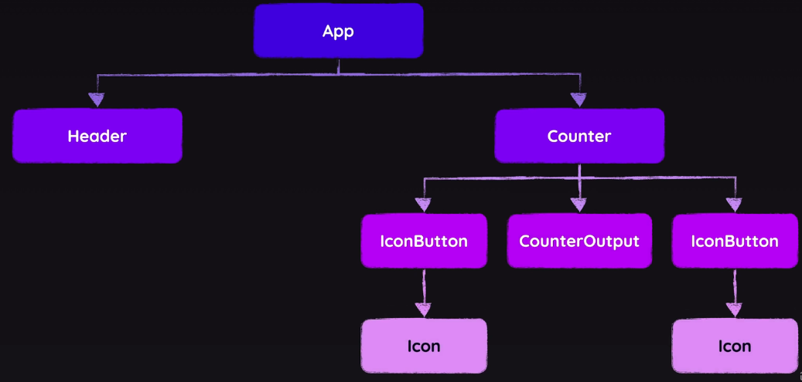

# 리액트 최적화

## 리액트가 동작하는 방식(어떻게 DOM을 업데이트 하는가?)

root와 연결된 APP 컴포넌트에서 트리 형태로 동작



React DevTools Profile로 쉽게 컴포넌트를 분석할 수있습니다.

## 가상 Dom 직접 알아보기

사용자가 웹에서 무언가를 하여 ui가 변경할 떄 크롬 개발자 도구에서 element를 보면 깜빡이는걸 볼 수 있는데 해당 부부이 DOM이 변경되는 현상입니다.

Virtual DOM  
페이지를 새로고침(실행)을 하면 전체 리액트 앱이 시작되며 처음 렌더링 됩니다.  
리액트는 컴포넌트 트리를 만들고 마지막에 렌더링 되어야하는 실제 HTML 코드를 컴포넌트 트리로부터 전달 합니다.  
그리고 Virtual DOM 스냅샷을 생성합니다. 물론 실제 DOM에 전달하지는 않고 가상으로 어떻게 생성해야 하는지 표시합니다.

리액트는 생성한 가상 DOM과 이전 마지막에 생성한 가상 DOM과 비교하여 틀린부분을 찾습니다.
틀린 부분(변동 사항)들을 실제 DOM에 적용합니다.

## State에 관리할 때 key의 역활

state는 컴포넌트 안에 있으며 해당 state는 다른 컴포넌트에 영향을 끼치지 않습니다 이를 이용해 컴포넌트 재사용이 가능합니다.

State는 타입만 중요한게 아니라 컴포넌트가 사용되는 위취에도 속해있습니다.
컴포넌트 유형 및 트리에서 (컴포넌트의) 위치별로 저장되는 리액트 트랙

`key`는 리액트에서 상태를 구체적인 컴포넌트 인스턴스에 매핑할 때 고려되는 요소 입니다.  
`useState(initialCount)`에 사용되는 초기 값은 컴포넌트 첫 실행 이후 다시 사용되지 않습니다. 


아래와 같이 `handleChange`를 통해 count 값을 변경하여 **Couter 컴포넌트** props에 넘겨진 `initial` 값은 변경 되지 않습니다.  

이유는 state의 초기 값으로만 사용되었기 때문입니다. 

이걸 고치기위해 `<Counter count={count}/>`에서 key를 추가하여 (`<Counter key={count} count={count}/>`) key에 변동이 있을 때 마다 이전에 인스턴스를 지우고 새로 생성합니다. 

```javascript
import { useState } from 'react'
import Counter from './Counter'

function App() {
  const [count, setCount] = useState(0)

  function handleChange(num) {
    setCount(num)
  }

  return (
    <div>
      <input type='number' value={count} onChange={(event) => handleChange(+event.target.value)}/>
      <Counter count={count}/>
    </div>
  )
}

export default App
```
```javascript
import { useState, memo } from "react"

const Counter = memo(function Counter({count}){
  const [initial, _] = useState(count)
  return(
    <span>{initial}</span>
  )
});
export default Counter;
```

## 최적화의 한 가지 memo

이전 컴포넌트와 현재 컴포넌트를 비교 속성값이 동일하다면 memo함수 내부에 있는 함수 실행을 저지 합니다.

하지만 값이 자주 바뀌는 컴포넌트 경우 memo는 성능을 낮추는 기능이기에 꼭 사용을 할 필요가 없습니다.

```javascript
import {memo} from 'react'

const Data = memo(function Data() {
  //... 생략
})

export default Data;
```

## 최적화의 useCallback, useMemo

`memo`는 컴포넌트 함수를 감싸는 것이고 `useMemo`는 컴포넌트 함수 안에 있는 일반 함수를 감싸서 방지합니다.

## State 업데이트 실행 방향

**setState를 사용한다고 해서 바로 state가 업데이트 되는게 아닙니다.**

```javscript
setCounter(2);
```

같은 함수에 여러개의 setState함수가 존재할 경우 다 같이 배칭되어 한 번의 리덴더링이 되도록 합니다.

```javascript
function handleClick(newNum) {
  setCounter(newNum);
  setCounter(prev => prev + 1);
}
```

속도 향상을 위한 million js 패키지