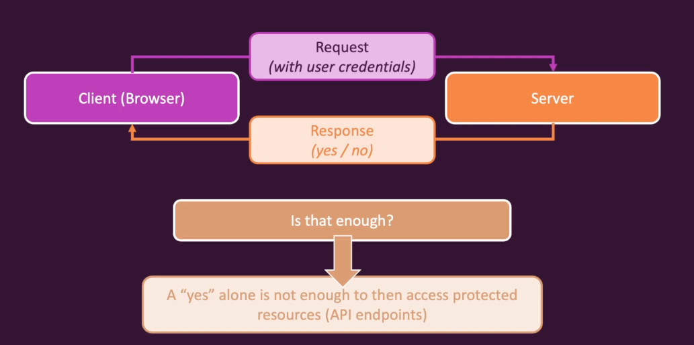

# 인증

어떠한 리소스는 아무나 접근이 가능해서는 안됩니다.
특정 백엔드 리소스에 접근하기 위해 접근권한이 주어지기 전에 반드시 인증을 받아야합니다.

## 인증이 구동되는 원리

- **Server-Side Sessions** 
  - 프론트엔드와 백엔드가 분리되지 않은 풀스택 앱에서 자주 사용합니다.
  - 사용자가 로그인하고 인증된 다음 서버에 고유식별자를 저장하는 겁니다.
  - 클라이언트에서 이후 요청에서 해당 ID를 전송하여 보호된 리소스에 접근합니다.
- **Authentication Tokens**
  - 분리된 백엔드에서 자주 사용합니다.
  - 사용자가 인증받은 다음 서버에서 사용자가 유요한 자격증명을 전송한 뒤 허가 토큰을 생성하거나 저장하지 않습니다.
  - 토큰은 알고리즘에 따라 생성된 스트링으로 몇가지 정보를 포함합니다.
  - 해당 토큰은 생성한 백엔드만이 해당 토큰의 유효성을 확인하고 검증합니다.

## 리액트에서 인증

## 인증의 지속성